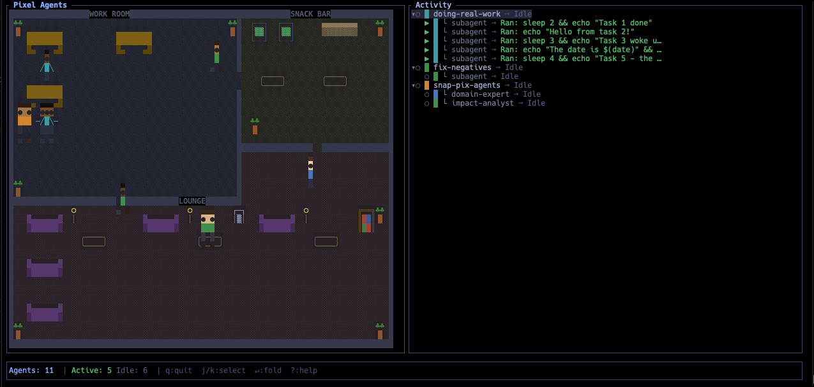

# Pixel Agents TUI

A terminal UI that visualizes Claude Code agent activity as animated pixel-art characters in a virtual office.



## What is it?

Pixel Agents TUI watches your active Claude Code sessions and represents each agent as an animated character in a pixel-art office. Characters walk around, sit at desks when working, wander to the lounge and snack bar when idle, and reflect real-time tool usage in the activity panel.

- Animated characters that type, read, walk, sit on couches, and use vending machines
- Subagents and team members appear as smaller characters with matching shirt colors
- Activity panel shows live tool status per agent (e.g. "Reading main.rs", "Running: cargo build")
- Diverse character palettes with varied skin tones and hair
- Multi-room office with Work Room (dynamic desks), Snack Bar, and Lounge
- BFS pathfinding through doorways and corridors
- Idle agents wander the office, sit on lounge couches, and grab snacks from vending machines
- Vim-style navigation with collapsible agent trees in the activity panel

## How it works

Claude Code writes JSONL transcripts to `~/.claude/projects/`. Pixel Agents TUI polls these files, parses tool invocations, and maps agent states to character animations. No API access or configuration required — just run it alongside your Claude Code sessions.

Agents are automatically discovered and removed based on file activity. Active agents sit at dynamically assigned desks; idle agents wander through the office, visiting the lounge and snack bar. Stale agents (no activity for 5 minutes) are cleaned up automatically.

## Install

```bash
brew tap esumerfd/pixel-agents-tui https://github.com/esumerfd/pixel-agents-tui
brew install pixel-agents-tui
```

Or build from source:

```bash
git clone https://github.com/esumerfd/pixel-agents-tui
cd pixel-agents-tui
cargo build --release
```

## Usage

```bash
pixel-agents-tui
```

### Controls

| Key | Action |
|-----|--------|
| `q` / `Esc` | Quit |
| `j` / `k` / `Up` / `Down` | Move cursor in activity panel |
| `h` | Collapse agent tree |
| `l` | Expand agent tree |
| `Enter` | Toggle collapse/expand |
| `d` / `u` | Page down / up |
| `gg` | Go to top of list |
| `G` | Go to bottom of list |
| `r` | Refresh agent list |
| `?` | Toggle help panel |

### Character States

| State | Description |
|-------|-------------|
| Typing at desk | Agent is writing code |
| Reading at desk | Agent is reviewing code |
| Walking | Pathfinding to a destination |
| Standing idle | Between turns, about to wander |
| Sitting on couch | Resting in the lounge |
| Using vending machine | Grabbing a snack |

### Activity Panel Icons

| Icon | Meaning |
|------|---------|
| `>` | Active — agent using tools |
| `*` | Waiting — needs user permission |
| `o` | Idle — between turns |
| `└` | Subagent — nested under parent |

## Requirements

- Rust 2024 edition
- A terminal with 256-color support

## Ideas

- Experiment with monitoring activity using hooks instead of polling files. See [agent-paperclip](https://github.com/fredruss/agent-paperclip) as an example.
- Can Rust generate an alternate hover UI like Clippy? Hum....

## Inspiration

Inspired by [pixel-agents](https://github.com/pablodelucca/pixel-agents), a VS Code extension by Pablo De Lucca that visualizes AI agents as pixel-art characters in an animated office scene.

## License

MIT
